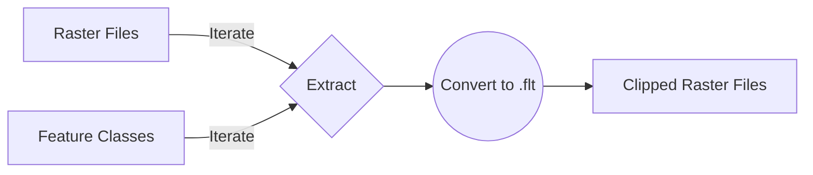

# Extract by Mask

A python script to clip multiple raster files to extends defined by feature classes (vector files). The program makes use of  **arcpy** module that is available in python 2 installed as part of  **ArcGIS**

## Program workflow

##### NB 
###### Change the input paths before running the program
